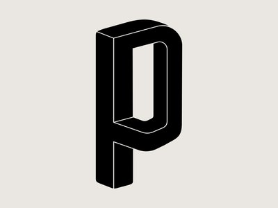

# <h1 align= "center"> PassApp </h1>

    

# How it works
PassApp allows users to create secure passwords easily and convenient. Using ElectronJS and cryptography, PassApp is able to create a secure interface for all your password needs. 

## Data Structures Used 

## Cryptography and Math 